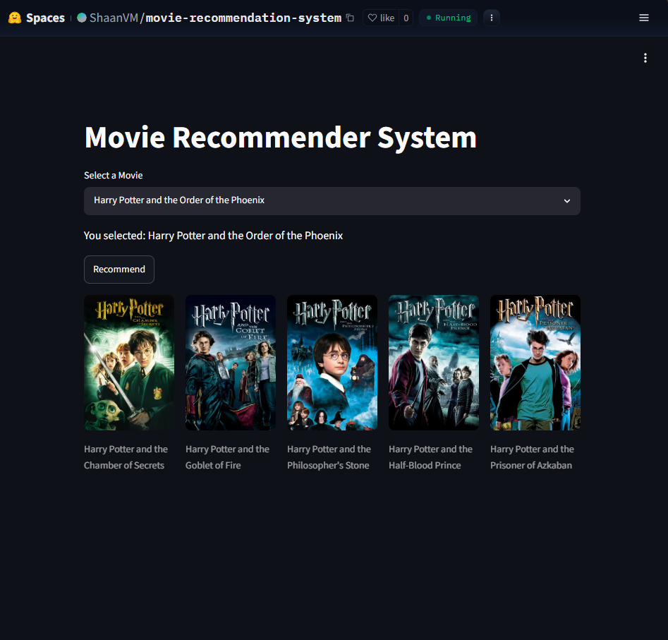

# 🎬 Movie Recommendation System

A content-based Movie Recommendation System built using Machine Learning, NLP, Streamlit, and the TMDB API. The application recommends similar movies based on movie metadata and displays movie posters through TMDB integration.

## 🚀 Live Demo

[](https://huggingface.co/spaces/ShaanVM/movie-recommendation-system)

## 📸 Application Preview

### Recommendations


## 📖 Project Overview

This project uses a content-based filtering approach to recommend movies similar to a selected movie. Movie features such as genres, keywords, cast, crew, and overview are processed using Natural Language Processing techniques and transformed into numerical vectors. Cosine similarity is then used to identify the most similar movies.

## 🎯 Features

* Content-based movie recommendations
* Interactive Streamlit web interface
* TMDB movie poster integration
* Fast similarity-based search
* Deployed on Hugging Face Spaces

## 🛠️ Tech Stack

* Python
* Pandas
* NumPy
* Scikit-learn
* NLTK
* Streamlit
* TMDB API
* Pickle

## 📂 Project Structure

MovieRecommendationSystem/

├── app.py

├── requirements.txt

├── README.md

├── artifacts/

│   ├── movies.pkl

│   └── similarity.pkl

└── notebooks/

```
├── movies.csv

└── credits.csv
```

## ⚙️ How It Works

1. Load movie and credits datasets
2. Perform data preprocessing and feature engineering
3. Combine important textual features
4. Apply Count Vectorization
5. Compute Cosine Similarity Matrix
6. Recommend top 5 similar movies
7. Fetch movie posters using TMDB API

## Dataset

 [TMDB 5000 Movie Dataset](https://www.kaggle.com/datasets/tmdb/tmdb-movie-metadata?select=tmdb_5000_movies.csv)


## 📊 Machine Learning Workflow

Dataset → Data Cleaning → Feature Engineering → Vectorization → Cosine Similarity → Recommendation Engine → Streamlit UI

## 🔧 Installation

Clone the repository:

git clone 

Install dependencies:

pip install -r requirements.txt

Run the application:

streamlit run app.py


## 👨‍💻 Author

Shaan Mathew

Aspiring Data Scientist | Machine Learning Enthusiast


